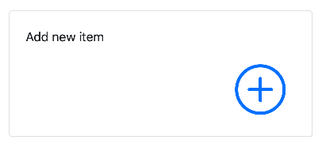
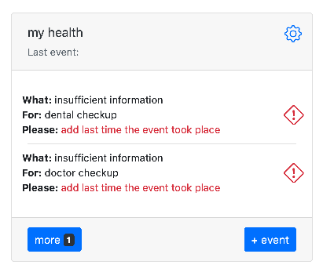

# Use cases

Different ways you can use Memseer 
{: .fs-6 .fw-300 }
---

## Motorcycle

You have a motorcycle and you want to inspect chain every 500 kilometers.

Go ahead and create new item. Give it a name, check “work units” and select
“kilometers”, don’t forget to select “origination date” in order to have proper scheduling. Now add new action by clicking “+” sign, filling out: “inspect chain
every 500 kilometers” and click “done”.

You will be brought back to the dashboard and you will see your item with a notice that it requires current kilometers
in order to calculate schedule.

Don’t worry this is one time action for new items. Click “add current kilometers” or red sign, fill in kilometers (all other
fields are populated already) and click “save”. Back to the dashboard and you can see approximate time when you will have to inspect the chain. You can set more
actions around the event, let’s say regardless of milage you want to inspect the chain once every 6 month. You can create new action: “inspect chain every 6
months”. Now Memseer will remind you to inspect the chain half a year after last inspection.

In addition to that you might want to inspect the chain more frequently during a particular season (tough conditions or more frequent use), and so you can add
new action as such: “inspect chain every 2 month between August and November”.

---

## House

You have a house, and it requires some minimum level of maintenance. Every few month air filter needs to be replaced. Do you need to inspect smoke and fire
detectors once per year? Every 12 years or so water tank needs to be replaced and perhaps every 15-20 years shingles on the roof should be replaced. No one
enjoys waking up one morning without hot water or water dripping from a top. So lets create a house item and set few actions to it.

Add new item, name it and add following actions:

* Replace air filter every 3 months
* Inspect smoke detectors every 1 years
* Replace water heater every 12 years

You can add as many actions as you want but for the example lets leave it at those.

Click “done” and you will be landed to dashboard with “my house” needing some attention. It needs to know when last time you performed those actions in order to
calculate schedule for the future. Let’s fill out that information.

Click on red icon next to “replace air filter” and change current date to the date when air filter got replaced last time. If you don’t remember, it is ok, just
approximate. Now click “save” and you will be back to the dashboard. Fill out the rest of the missing information for “inspect smoke detectors” and “replace
water heater”.

Now that everything is populated, you can see “my house” on the dashboard with information on each particular action: what is the action, when it should occur
and last time the event took place. Everything is at the palm of your hand. Enjoy!

---

## Lawn mower

You have gasoline lawn mower, like everything else it needs attention. For example: air filter needs to be cleaned every 25 hours of use. Oil change should be
done every 50 hours of work or every 25 under heavy loads. Check grass bag every 100 hours of use and don’t forget to replace spark plug every 150 hours. In
addition flywheel break pad, valve clearance and pinion gears should be check, adjusted and/or greased every 100 hours. Kinda long list to remember, but we can
use memseer to keep track of each and every point.

Let’s add new item, give it a name “my lawn mower”, click “work units” and select “hours” from the dropdown. Let’s select “origination date” to manufacturing
date, it can be approximated to a year if you don’t remember when it was purchased. Now it is time to set actions, click “+” under actions and populate fields
so it reads as: “clean air filter every (repeats every) 25 hours”. Let’s keep adding new actions, click “+” for every new action:

* replace oil every 50 hours
* inspect grass bag every 100 hours
* replace spark plug every 150 hours
* inspect flywheel break pad every 100 hours
* adjust valve clearance every 100 hours
* add grease pinion gears every 100 hours

Now that you entered all the required actions, click “done”. You will land back to dashboard and see new item “my lawn mower” with warning sign saying
“insufficient information… add current hours”. Memseer doesn’t know how many hours did you put on your lawn mower so far and it needs to know in order to
calculate when and what needs to be done. Click on warning sign and populate field “hours” with current milage so to speak, let’s say you done 5 hours so far,
enter 5 and click “save”, back to the dashboard and you can see “my lawn mower” with a schedule, “what and when” something needs to be done.

When time come and you completed an action, lets say “clean air filter”, you can click on check mark across the action on the dashboard, enter current hours (
ex.: 25 hours) and memseer will re-calculate all the action in order to provide you with approximate count down when next action is required. You don’t have
keep hand-written notes and check it every time you are about to use the mower.

---

## My cat (or any other pet)

You got a cat, which needs to be looked after, periodically vaccinated, given anti-parasite medication and occasionally have its nails cut. Let’s create new
item, so we can effortlessly keep track of all important events. Give it a name and set origination date to the birthday of the cat. Next click “+” and add
actions such as “anti parasite treatment”. Consult your veterinarian on the frequency of the treatment. In our example we will set frequency to every 3 month
and a period from March to November. One more thing, it would be nice to have medication name and brand written down, so you don’t have to remember or search
for it if you need to purchase it again. Click on yellow icon “notes” and add all the information. Now click “done” and you will be returned to the dashboard.
At this point you can start keeping a log of pet’s treatment. Click icon “checkbox” and enter a date when you gave your pet anti-parasite medication last time.
Don’t forget to click “save”, so memseer remembers the information and calculates next date for the action.

---

## Health

Health is one of the most precious things we got. We tend to not think of it when everything is well, but it is all we can think of, otherwise. Life is busy,
we all get carried away and not every health provider remembers to get a hold of you for annual (or semiannual) checkup. Let’s take charge of it and setup
yearly checkup with doctor, dentist and perhaps a blood donation.

Add new item and name it “my health”, you can add your own birthday (if you want). Let’s add following actions:

* doctor checkup every 1 year
* dental checkup every 1 year
* donate blood every 1 year

Click “done” and new item is happy to report that some additional information is needed.

It needs to know when was the last time you had checkups. Click red link, set the date of the last time you did checkup and click “save”. 
Repeat this step two more times, and now you can track when was the last time you did checkups and/or when you should schedule (or expect) to have next one.

---

## Keep in touch

We all know - life is busy. Sometimes time flies so fast that it is hard to remember and recollect when was the last time you spoke to a friend or a family member or even a client, and what was the conversation about. You know it is important, you know if you just recall one piece, the entire conversation will come back to you. How long has it been since you’ve last spoken? Did she get a new job or a promotion? What is a name of new born? What present did I send her last Christmas? We all been there, but we don’t have to anymore.

Create new item, give it a name (say sister Jesse), perhaps add an action: “contact Jesse” every 20 days. 

Click “done” and return to dashboard.

Click on “add last time the event took place”, pick the date you contacted Jesse last time, add notes and click “save”.

Back at the dashboard and see next time you should contact Jesse. More over you can add event, let’s say you want to remember a flower shop that had great selection and delivered on time. Click “+ event”, give it a name (ex.: “send birthday flowers”), pick a date when you sent flowers, add notes and click “save”.

You can view all the events by click on “sister Jesse”

This way you can go back in time and recall what’s important to you and always keep in touch with people you care about.
